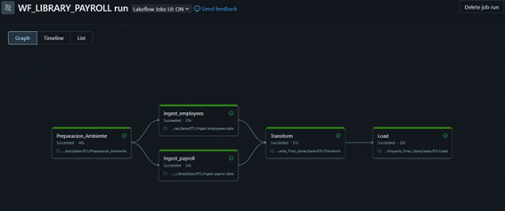

# Proyecto_Databricks_LibraryStore
Proyecto final curso Ingeniería de datos e IA con Databricks usando data de Northern Lights Book Co , una cadena de librerias medianas en Calgary, Alberta

# 📚 Northern Lights Book Payroll ETL Pipeline
### Arquitectura Medallion en Azure Databricks

[](https://databricks.com/)
[](https://azure.microsoft.com/)
[](https://spark.apache.org/)
[](https://delta.io/)
[](https://databricks.com/)
[](https://github.com/features/actions)

*Pipeline automatizado de datos para análisis de pagos por comisiones y ventas de una cadena de librerias con arquitectura de tres capas y despliegue continuo*

## 🎯 Descripción

Pipeline ETL enterprise-grade que transforma datos crudos de empleados y pagos de una cadena de librerias en diferentes periodos y tiendas fisicas y almacenamiento, implementando la **Arquitectura Medallion** (Bronze-Silver-Gold) en Azure Databricks con **CI/CD completo** y **Delta Lake** para garantizar consistencia ACID.

### ✨ Características Principales

- 🔄 **ETL Automatizado** - Pipeline completo con despliegue automático via GitHub Actions
- 🏗️ **Arquitectura Medallion** - Separación clara de capas Bronze → Silver → Gold
- 📊 **Modelo Dimensional** - Star Schema optimizado para análisis de negocio
- 🚀 **CI/CD Integrado** - Deploy automático en cada push a master
- 📈 **Databricks Dashboards** - Visualización

---

## 🏛️ Arquitectura

### Flujo de Datos

```
📄 CSV (Raw Data)
    ↓
🥉 Bronze Layer (Ingesta sin transformación)
    ↓
🥈 Silver Layer (Limpieza + Modelo Dimensional)
    ↓
🥇 Gold Layer (Agregaciones de Negocio)
    ↓
📊 Databricks Dashboards (Visualización)
```

[](https://blog.bismart.com/arquitectura-medallion-data-lakehouse)


### 📦 Capas del Pipeline

<table>
<tr>
<td width="33%" valign="top">

#### 🥉 Bronze Layer
**Propósito**: Zona de aterrizaje

**Tablas**: 
- `employees` 
- `payroll`


</td>
<td width="33%" valign="top">

#### 🥈 Silver Layer
**Propósito**: Modelo dimensional

**Tablas**:
- `payroll_transformed`

</td>
<td width="33%" valign="top">

#### 🥇 Gold Layer
**Propósito**: Analytics-ready

**Tablas**:
- golden_payroll_partitioned        : Monto total en payroll agrupado por tipo de local y año (últimos 2 años)


</td>
</tr>
</table>

---

## 📁 Estructura del Proyecto

```
etl-library/
│
├── 📂 .github/
│   └── 📂 workflows/
│       └── 📄 deploy-notebook.yml    # Pipeline CI/CD deploy dev to produccion workspace databricks
├── 📂 proceso/
│   ├── 🐍 Ingest_employees_data.py           # Bronze layer
│   ├── 🐍 Ingest_payroll_data.py             # Bronze Layer
│   ├── 🐍 Load.py                            # Silver Layer
│   ├── 🐍 Transform.py                       # Golden Layer
├── 📂 scripts/
|   ├── 🐍 Preparacion_Ambiente.py            # Create Schema, Tables, External location
├── 📂 seguridad/
|   ├── 🐍 Grants-Medallion.py                # Sql Grant
├── 📂 Reversión/
|   ├── 🐍 Revoke-Medallion.py                # Revoke permissions
├── 📂 dashboard/                             # Databricks Dashboards 
└── 📄 README.md
```

---

## 🛠️ Tecnologías

<div align="center">

| Tecnología | Propósito |
|:----------:|:----------|
|  | Motor de procesamiento distribuido Spark |
|  | Storage layer con ACID transactions |
|  | Framework de transformación de datos |
|  | Data Lake para almacenamiento persistente |
|  | Automatización CI/CD |
|  |  Visualización |

</div>

---

## ⚙️ Requisitos Previos

- ☁️ Cuenta de Azure con acceso a Databricks
- 💻 Workspace de Databricks configurado
- 🖥️ Cluster activo (nombre: `DS_Cluster`)
- 🐙 Cuenta de GitHub con permisos de administrador
- 📦 Azure Data Lake Storage Gen2 configurado
- 📊 Power BI Desktop (opcional para visualización)

---

## 🚀 Instalación y Configuración

### 1️⃣ Clonar el Repositorio

```bash
git clone https://github.com/keilacahuana/Proyecto_Databricks_LibraryStore.git
cd project-databricks
```

### 2️⃣ Configurar Databricks Token

1. Ir a Databricks Workspace
2. **User Settings** → **Developer** → **Access Tokens**
3. Click en **Generate New Token**
4. Configurar:
   - **Comment**: `GitHub CI/CD`
   - **Lifetime**: `90 days`
5. ⚠️ Copiar y guardar el token

### 3️⃣ Configurar GitHub Secrets

En tu repositorio: **Settings** → **Secrets and variables** → **Actions**

| Secret Name | Valor Ejemplo |
|------------|---------------|
| `DATABRICKS_HOST` | `https://adb-xxxxx.azuredatabricks.net` |
| `DATABRICKS_TOKEN` | `dapi_xxxxxxxxxxxxxxxx` |

### 4️⃣ Verificar Storage Configuration

```python
storage_path = "abfss://raw@adlbsdb1011.dfs.core.windows.net/"
```

<div align="center">

✅ **¡Configuración completa!**

</div>

---

## 💻 Uso

### 🔄 Despliegue Automático (Recomendado)

```bash
git add .
git commit -m "✨ feat: mejoras en pipeline"
git push origin master
```

**GitHub Actions ejecutará**:
- 📤 Deploy de notebooks a `/main`
- 🔧 Creación del workflow `WF_LIBRARY_PAYROLL`
- ▶️ Ejecución completa:  Bronze → Silver → Gold
- 📧 Notificaciones de resultados

### 🖱️ Despliegue Manual desde GitHub

1. Ir al tab **Actions** en GitHub
2. Seleccionar **Deploy ETL Apple Sales And Warranty**
3. Click en **Run workflow**
4. Seleccionar rama `main`
5. Click en **Run workflow**

### 🔧 Ejecución Local en Databricks

Navegar a `main` y ejecutar en orden:

```
- Preparacion_Ambiente.py         → Crear esquema
- Ingest_employees_data.py        → Bronze Layer
- Ingest_payroll_data.py          → Bronze Layer
- Load.py                         → Silver Layer
- Transform.py                    → Gold Layer
```

---


## 🔄 CI/CD

### Pipeline de GitHub Actions

```yaml
Workflow: Deploy ETL Library
├── Deploy notebooks → /main
├── Eliminar workflow antiguo (si existe)
├── Buscar cluster configurado
├── Crear nuevo workflow con 5 tareas
├── Ejecutar pipeline automáticamente
└── Monitorear y notificar resultados
```

### 🔄  Workflow Databricks

```


⏰ Schedule: Diario 8:00 AM (Lima)
⏱️ Timeout total: 3 min
 🔒 Max concurrent runs: 1
⏰ Notificaciones: 
      success: keila19.1307@gmail.com
      failed:  keila19.1307@gmail.com
```

---

## 📈 Dashboards
https://github.com/keilacahuana/Proyecto_Databricks_LibraryStore/tree/dev/dashboard

## 🔍 Monitoreo

### En Databricks

**Workflows**:
- Ir a **Workflows** en el menú lateral
- Buscar `WF_LIBRARY_PAYROLL`
- Ver historial de ejecuciones

**Logs por Tarea**:
- Click en una ejecución específica
- Click en cada tarea para ver logs detallados
- Revisar stdout/stderr en caso de errores

### En GitHub Actions

- Tab **Actions** del repositorio
- Ver historial de workflows
- Click en ejecución específica para detalles
- Revisar logs de cada step

---

## 👤 Autor

<div align="center">

### Keila Cahuana Alcantara

[](https://www.linkedin.com/in/keila-cahuana-alcantara-304130194/)
[](https://github.com/keilacahuana)

**Data Engineering** | **Azure Databricks** | **Delta Lake** | **CI/CD**

</div>

---

## 📄 Licencia

Este proyecto está bajo la Licencia MIT - ver el archivo [LICENSE](LICENSE) para más detalles.

---

<div align="center">

**Proyecto**: Data Engineering - Arquitectura Medallion  
**Tecnología**: Azure Databricks + Delta Lake + CI/CD  
**Última actualización**: 2025


</div>